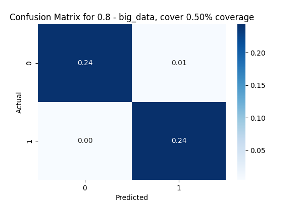

## Team 5 Final Project


### Running the code it will get the plot for confusion matrix plot and also store the low confidence data into new csv file. 

### Dataset
### train, test: https://www.kaggle.com/datasets/abhi8923shriv/sentiment-analysis-dataset?select=testdata.manual.2009.06.14.csv
### Yelp: https://www.kaggle.com/datasets/ilhamfp31/yelp-review-dataset
### 10000 Restaurant Reviews: https://www.kaggle.com/datasets/joebeachcapital/restaurant-reviews
### IMDB: https://www.kaggle.com/datasets/lakshmi25npathi/imdb-dataset-of-50k-movie-reviews

```bash
# Run poetry for environment
poetry shell

# run the main code
python main.py
```

# If you want to combine all data and run once
```bash
python main.py --bigdata
```
A Random Forest model will be trained first and it's model stored in ```models/big_data.pkl```, subsequent runs will skip Random Forest training if a model has been trained. Use the ```--overwrite``` flag to force retraining and starts predicting using the saved model. The model will then goes on to train a distilBERT model using the low confidence data. To skip Random Forest altogether, use the ```--skiprf``` flag.

# Training results
## Random Forest
Training results for Random Forest training is stored in ```plots```. Here is the confusion matrix for one of the training run where we used 80% confidence interval.


## distilBERT
Training results for the distilBERT model is stored in ```./BERT/figures/model_v[version]``` where ```version``` is a string indicating the current version of the model inside the folder. Inside, there will be several ```fold_{number}``` where the results of each K-fold evaluation run will be stored in 3 files:
- ```confusion_matrix*.png```: Store the confusion matrix of the evaluation of the model trained during that fold. 
- ```loss_curve*.png```: Store the loss training curve of the model from start to finish 
- ```metrics*.txt```: Store statistical scores as well as the confusion matrix in a text file [metrics](./BERT/figures/model_v1/fold_1/metrics_fold_1.txt)

## Hybrid approach
In this approach, we are mainly interested in the combined evaluation performance of the 2 models. Thus, the program will use both Random Forest or distilBERT if RF has confidence below 80%. 